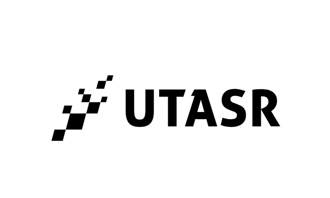

    

<h2>Welcome to the UTASR (University of Toronto Scale Racing) Repository!</h2>

We are a dedicated group of students focused on the development and innovation of autonomous RC racing. This repository is an internal resource for our development projects, documentation, and collaborative efforts.

<h3>Our Teams</h3>
<ul>
    <li><strong>Software:</strong>
        <ul>
            <li>Data Preprocessing</li>
            <li>Machine Learning</li>
            <li>Validation / Performance</li>
            <li>Web Development</li>
        </ul>
    </li>
    <li><strong>Hardware:</strong>
        <ul>
            <li>Mechanical</li>
            <li>Electrical</li>
            <li>Firmware</li>
        </ul>
    </li>
</ul>

<h3>Contribution Guidelines</h3>
<ol>
    <li>Fork the repository.</li>
    <li>Create a new branch (<code>git checkout -b feature-branch</code>).</li>
    <li>Commit your changes (<code>git commit -am 'Add new feature'</code>).</li>
    <li>Push to the branch (<code>git push origin feature-branch</code>).</li>
    <li>Submit a Pull Request for review.</li>
</ol>

<h3>Contact Information</h3>

For updates and inquiries, please join our Discord server: <a href="https://discord.gg/CNnUEMaX">UTASR Discord</a>.

Thank you for your contributions and dedication to our projects! - UTASR Design Leads
